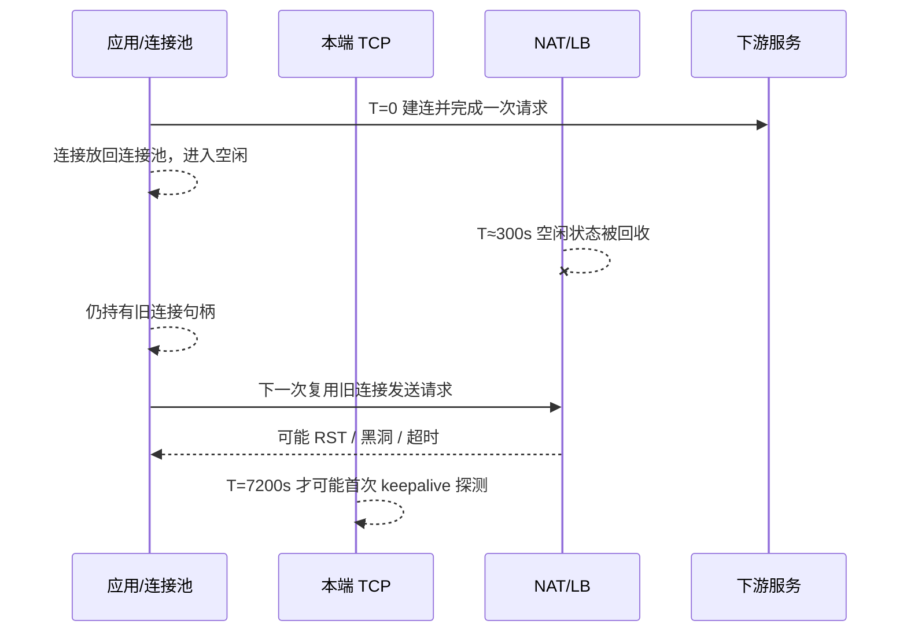

# 连接生命周期时间线

## 证据性质

[推演]

本时间线基于立意阶段已验证事实和工程常识：Linux keepalive 默认首次探测时间为 7200s；真实基础设施中存在 4 分钟、350s、5 分钟级 idle timeout。它用于解释“为什么应用层晚于中间设备感知失败”，不是用户生产环境抓包记录。

## 核心假设证伪检查

| 问题 | 回答 |
|---|---|
| 核心假设 | 如果 TCP keepalive 首次探测时间晚于 NAT/LB idle timeout，本端无法在中间设备回收前主动发现连接失效。 |
| 最可能推翻它的证据 | 实际链路没有中间设备 idle timeout；或应用/连接池在中间设备回收前已经主动关闭连接；或启用了应用层心跳。 |
| 处理方式 | 正文必须写条件句：当链路存在分钟级 idle timeout，且应用/连接池没有更早回收或心跳时，这个错配才成立。 |

## 时间线

| 时刻 | 哪一层发生动作 | 状态变化 | 应用看到什么 |
|---:|---|---|---|
| T=0 | 应用 / 连接池 | 建立连接，连接进入池中 | 请求成功 |
| T=0~300s | 应用 | 连接长期空闲，无应用层流量 | 没有异常 |
| T≈300s | NAT/LB | 空闲窗口到期，中间设备回收连接状态 | 通常没有主动通知应用 |
| T>300s | 应用 / 连接池 | 连接池仍可能持有旧连接句柄 | 应用仍以为连接可复用 |
| 下一次复用 | 应用 / TCP / 中间设备 | 旧连接再次发送数据，链路状态已不一致 | 可能表现为 timeout、RST、broken pipe 或一次重试后成功 |
| T=7200s | TCP keepalive | 如果连接一直空闲且 SO_KEEPALIVE 已开启，本端才首次探测 | 已经远晚于 5 分钟级回收窗口 |

## Mermaid 草稿

## 可供正文引用的结论

1. 这个问题最迷惑人的地方是：中间设备回收状态时，应用层不一定立刻知道。
2. 应用看到的“接口 timeout”，可能只是它第一次重新使用那条旧连接时才暴露出来的结果。
3. 因此排查顺序不能只盯着接口耗时，还要看连接是否长期空闲、连接池是否复用旧连接、链路中是否有分钟级 idle timeout。
